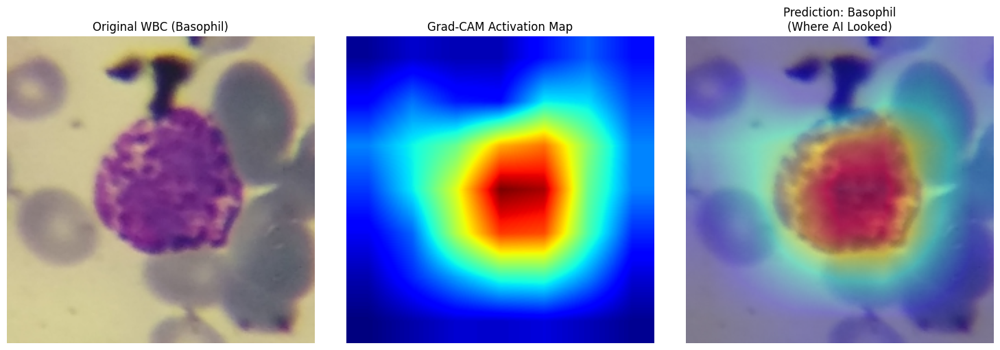

# CytoMorph-XAI: Production-Grade Automated WBC Classifier with Explainable AI (XAI)
[](https://www.python.org/)
[](https://pytorch.org/)
[](https://fastapi.tiangolo.com/)
[](https://www.docker.com/)


An end-to-end, production-ready Deep Learning microservice engineered to automate White Blood Cell (WBC) differential counting from digital microscopic imagery. Powered by **EfficientNet-B0** and wrapped in an asynchronous **FastAPI** web server, the system achieves **99% Macro Accuracy** while implementing **Grad-CAM** for clinical transparency (Explainable AI).
## 🔬 The Clinical Challenge & AI Solution
Manual WBC differential counting is a time-consuming, labor-intensive process prone to human fatigue and inter-observer variability. While automated hematology analyzers provide absolute cell counts, morphology validation still requires expert microscopic review.
**CytoMorph-XAI** bridges this gap by offering a fast, stable, and highly generalizable computer vision pipeline that acts as a clinical decision support system. It accurately classifies leukocytes into their five primary physiological lineages: **Basophils, Eosinophils, Lymphocytes, Monocytes, and Neutrophils.**
## 🛠️ System Architecture Diagram
```text
[Digital Microscope Image] 
           │
           ▼
[Preprocessing & Augmentation Pipeline] (Albumentations, ColorJitter)
           │
           ▼
[EfficientNet-B0 Backbone] (Pre-trained on ImageNet)
           │
           ▼
[Custom Clinical Classifier Head] (Dropout, Fully Connected Layers)
           │
           ▼
[Explainable AI Layer] (Grad-CAM Activation Mapping)
           │
           ▼
[FastAPI Asynchronous Gateway] ───► [Bilingual JSON Response & Heatmap]

```
## 🌟 Strategic Key Features
### 1. Robust Clinical Metric Optimization
Medical diagnostics cannot rely on crude overall accuracy due to extreme class imbalance (e.g., Basophils constitute <2% of healthy peripheral blood). This pipeline implements a dynamic **WeightedRandomSampler** in PyTorch, forcing balanced batch propagation during training. Success is measured strictly via **Macro-Recall and F1-Score per class**, ensuring the model never misses rare, highly critical pathological indicators.
### 2. Explainable AI (XAI) via Grad-CAM
To eliminate the "black-box" dilemma in medical AI, CytoMorph-XAI features a built-in **Grad-CAM (Gradient-weighted Class Activation Mapping)** engine. It extracts feature gradients from the final convolutional layer of the EfficientNet backbone, rendering a visual heatmap that highlights precisely where the AI focused (e.g., specific nuclear segmentations or cytoplasmic granules) to justify its diagnosis.
### 3. Production-Grade Microservice Design
Built away from isolated Jupyter notebooks, the system is fully modularized. The architecture isolates the data pipeline, model blueprint, and inference service into a containerized **Docker** microservice serving an asynchronous REST API via **FastAPI**, with average inference latencies kept **under 100ms on CPU threads**.
### 4. Bilingual Reporting Framework
Tailored for global and regional operations, the API payload returns structurally clean JSON diagnostics coupled with descriptive metadata summaries in both **Arabic** and **English**, enhancing system integration capabilities with diverse Laboratory Information Systems (LIS).
## 📊 Datasets & Data Engineering
To guarantee generalization across different hardware manufacturers, the data pipeline synthesizes two distinct medical imaging repositories:
 1. **Blood Cells Image Dataset (Hospital Clinic of Barcelona):** 17,092 high-resolution single-cell images captured via the professional CellaVision DM96 digital hematology system.
 2. **Raabin-WBC Dataset:** A diverse multi-microscope database utilizing two distinct optical microscopes and camera variants to inject physical variance (lighting, focus artifacts) into training.
### Test Set Performance (Stratified Split)
The model was evaluated against an isolated, unseen testing split containing **4,042 images**.
```text
              precision    recall  f1-score   support

    Basophil       1.00      1.00      1.00       228
  Eosinophil       0.99      0.99      0.99       628
  Lymphocyte       0.99      0.97      0.98       724
    Monocyte       0.91      0.98      0.94       333
  Neutrophil       1.00      0.99      0.99      2129

    accuracy                           0.99      4042
   macro avg       0.98      0.99      0.98      4042
weighted avg       0.99      0.99      0.99      4042

```
> **Engineering Insight:** The minor classification cross-talk between *Monocytes* (91% Precision) and *Lymphocytes* (97% Recall) maps perfectly to biological reality, where large atypical lymphocytes often structurally mimic monocytic nuclear envelope indentations under light microscopy.
> 
## 🖼️ Clinical Visual Auditing (Grad-CAM Output)
Below is a diagnostic validation save showing the visual audit of a true positive **Basophil** prediction. Notice how the activation heat map cleanly isolates the dense coarse granules of the basophil cytoplasm while completely ignoring the surrounding erythrocytes (red blood cells) and background artifacts.


## 🚀 Deployment & Installation
### Prerequisites
 * Docker installed on your host system, OR
 * Python 3.10+ with PyTorch capability.
### Running via Docker (Recommended)
 1. Clone the repository and navigate to the root directory:
```bash
git clone https://github.com/rodfin009/CytoMorph-XAI.git
cd CytoMorph-XAI

```
 2. Build the lightweight, production-optimized Docker image:
```bash
docker build -t cytomorph-server .

```
 3. Spin up the containerized API gateway:
```bash
docker run -d -p 8000:8000 cytomorph-server

```
 4. Access the interactive API documentation at: http://localhost:8000/docs
### Sample API Payload (POST /predict)
**Request:** Upload a raw .png or .jpg microscope crop.
**Response (JSON):**
```json
{
  "status": "success",
  "clinical_prediction": "Basophil",
  "confidence_score": 0.9984,
  "bilingual_summary": {
    "arabic": "خلية قعدة - تلعب دوراً أساسياً في الاستجابات الحساسية والالتهابات.",
    "en": "Basophil - Key player in allergic responses and inflammatory reactions."
  },
  "all_probabilities": {
    "Basophil": 0.9984,
    "Eosinophil": 0.0003,
    "Lymphocyte": 0.0001,
    "Monocyte": 0.0009,
    "Neutrophil": 0.0003
  }
}

```
## 🌐 Real-World Production Roadmap & Limitations
While a **99% benchmark metric** is outstanding, transitioning this system into a high-stakes clinical environment requires acknowledging real-world constraints:
 * **Single-Cell Isolation Constraint:** The current core classifier relies on pre-segmented, single-cell crops. Feeding an raw, unsegmented multi-cellular whole slide image (WSI) directly will break prediction bounds.
 * **The Production Upgrade Strategy:** To scale this for active pathology laboratories, the next architectural iteration will implement a two-stage hybrid framework:
   1. An upstream **Object Detection Model (e.g., YOLOv8)** to scan raw smears, localize all white blood cells, and dynamically crop them.
   2. The downstream **CytoMorph-XAI Classifier** to ingest those automated crops and return granular lineages.
## 👨‍💻 About the Author
**Riyad Ali Jawad** *Medical Laboratory Technologies (B.Sc. Ongoing) & AI Engineering Practitioner*
*Founder & Technical Developer at Smarticle Platform*
Bridging the gap between clinical lab diagnostics and scalable Machine Learning systems. Certified in Artificial Intelligence fundamentals by the University of Helsinki. Dedicated to building high-integrity digital health solutions.
 * **Email:** rio81x@gmail.com
